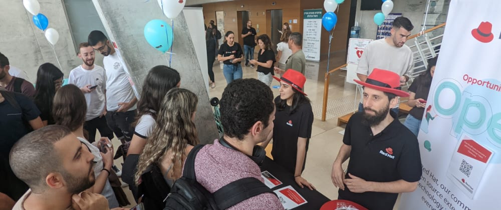
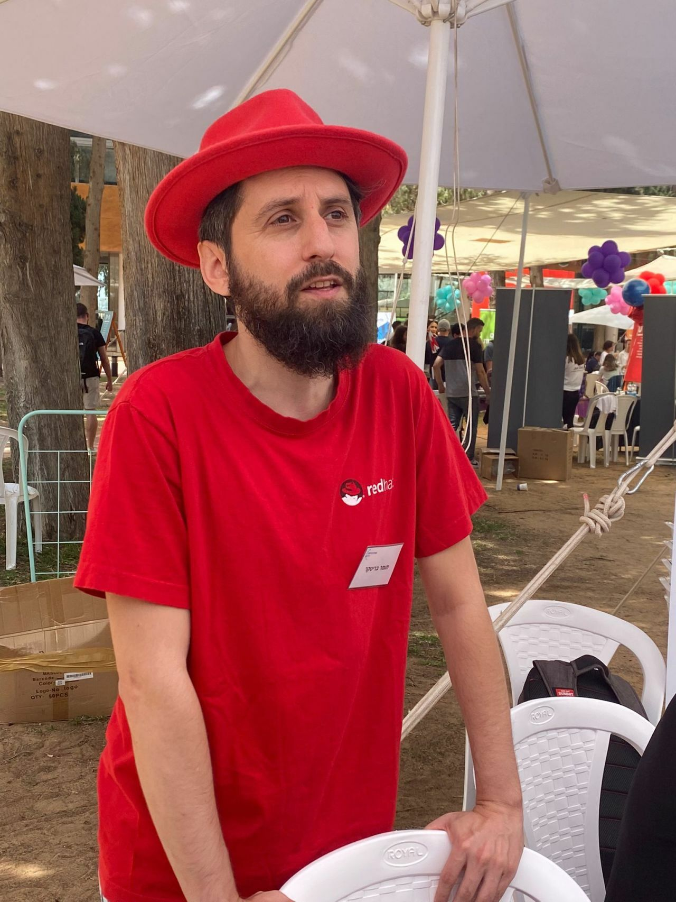

# Attending recruiting fairs as an engineer

Over the years, I’ve attended many student recruitment fairs representing Red Hat, including a couple in the recent weeks. I always try to go to at least one fair every year if possible.

But you might be wondering, is this the best usage of an engineer’s expensive work hours? Isn’t that the job of the talent acquisition team?
In my opinion, there is a lot of value for engineers to take part in these events, both for the organization and for the engineers themselves.

From the organization's perspective, let’s look at the several different goals from attending these events:

- The obvious goal, **recruiting new employees**. While recruiting is the TA team’s speciality, engineers can provide additional value - for example, answering candidates’ technological questions better, or quickly identifying promising candidates that might get missed otherwise. Candidates often prefer to talk with actual engineers and trust them more than the people whose job is to promote the company to them but lack in technical skills.
- **Employee branding**: A few lucky students might get hired - but the impact of the fair can be much wider. Having enthusiastic engineers take part in the fair can do a lot in terms of exciting students about the company and how cool it would be to work there. Some students might not yet fit the requirements of your open positions, and an engineer can give them pointers and advice on what they need to do to get accepted in the future. The students are usually at the start of their career, and if you manage to make a good impression on them they might consider your company a good option for their entire career. Building the company’s reputation as a good employer helps get more candidates into the hiring pipeline.
- **Potential future customers**: If your company’s products or services are targeted at a technically-proficient user base, you might meet people who will go on to work at one of your future customers. Building awareness of your products could help with sales down the line, and who better to excite future engineers about how great your products are than the people working on them?
- **Connecting employees to company mission**: When people promote the company, they need to learn more about what it does and how to explain its mission quickly to others. Representing the company is a great way to increase employee engagement with your company, and increase their awareness of the company strategy beyond their day-to-day work.

But why should you, as an engineer, take precious time away from your development work to go to a student fair?

- **Company-wide impact**: One of the key criteria for career advancement in most companies is closely related to your impact. Affecting the hiring process is one of the most significant and long-lasting impacts you can make. The people hired today will be a key factor in the company’s future success, and they may even outlast you as an employee. If you manage to improve the quality of the candidates hired, this will have a compound impact for years to come.
- **Practice public speaking and interpersonal communication skills**: If you’re an introvert like me, talking to strangers can be very tough. Recruitment fairs provide you with an opportunity to talk to people who you know are interested in what you have to say and hearing about your job. Sometimes you will get a somewhat pre-scripted pitch, so you don’t even have to prepare too much content - only describe the company to candidates and talk with them about your job.
- **Day out**: Whether you normally work from home or the office, recruitment fairs are a great chance to break out from the regular routine, get a bit of vitamin D into your blood, stretch your muscles and breathe some fresh air. Your body will thank you for it.
- **Networking**: Building a strong and wide network is key to growing your career and landing future opportunities. You will likely find yourself at the booth with people from your organization who you might not have worked with before. You might even make some connections with candidates or people staffing other companies’ booths. Take the time to get to know some of them better - who knows where they’ll be in the future and how they might be able to help you.
